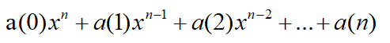
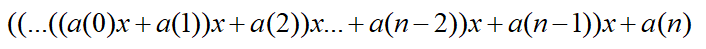

### 哈希表
> 源码目录：/src/structures/HashTable

#### 理论知识大解析
> 概念解析：哈希表

哈希表又称散列表，是一种应用非常广泛的数据存储技术。在哈希表上插入、删除、获取元素效率都非常高。在这里我们基于数组封装哈希表，
把要存储的数据的`key`值哈希化为指定范围的数组下标，并把`value`值存在数组对应下标处，最后生成的数据表就叫**哈希表**。哈希表可
根据存储元素的多少和哈希表的长度进行相应的扩容或者缩容；

> 概念解析：哈希化

哈希化也就是哈希函数，把要存储的数据的`key`转化为数字的函数；

> 概念解析：地址冲突（碰撞）

因为要存储的数据是无限的，但是哈希表的长度是有限的，所以在对传入的数据的`key`值哈希化的时候，难免会出现两个不同的`key`的哈希值相同的情况，
这个时候哈希地址就产生了冲突，我们需要使用**开链法**或者**开放地址法**去解决冲突；

> 概念解析：开链法

顾名思义就是在对应的哈希地址开发新的链表或者数组存储新的数据，也就是在同一个哈希地址放一个链表或者数组，然后把映射到同一个哈希地址的元素存到这个链上，
获取的时候拿到对应哈希地址的链表然后遍历取值（哈希函数写的好的情况下，元素在哈希表上分布比较均匀，所以这个链表或数组的长度一般都比较短）；

> 概念解析：开放地址法

当哈希地址发生冲突的时候，累加哈希值找到第一个数据为空的哈希地址，然后把数据存到这个里的方法叫开发地址法；查找第一个数据为空的哈希地址时又有
**线性探测**、**再哈希**等方法；

> 概念解析：扩容、缩容

当存储的数据达到目前哈希表长度的80%的时候我们需要给哈希表进行扩容，同样当存储的数据只有目前哈希表长度的20%时我们需要对哈希表进行缩容；

> 概念解析：质数

质数就是除了1和他本身再没有其他因数的数字，由于质数的这个特性，我们在生成`hash`值时会使用质数为公因数以及哈希表的长度设置为质数，这样可以
均匀分配哈希地址，减少冲突的产生；

#### 哈希表实现（`javascript`）

| 接口             | 说明 |
| ---------------- | ---- |
| `getHashCode(key)` | 获取`key`对应的哈希值     |
|  `put(key, value)`       | 存储或修改数据 |
| `get(key)` | 根据关键字获取数据 |
| `delete(key)` | 根据关键字删除数据 |
| `isPrime(num)` | 判断是不是质数 |
| `getPrime(num)` | 获取大于等于num的最近的一个质数 |
| `resize(limit)` | 对哈希表扩容或者缩容 |
| `size()` | 获取哈希表的数据量 |
| `isEmpty()` | 判断哈希表是否为空 |


> 代码清单：HashTable类构造器

1. `table`用来承载哈希表；
2. `limit`定义哈希表的长度；
3. `count`记录哈希表数据的个数；
4. **`DEFAULT_LIMIT`为全局定义的哈希表默认长度**
```javascript
class HashTable{
    constructor(limit){
        this.table = [];
        this.limit = limit || DEFAULT_LIMIT;
        this.count = 0;
    }
}
```
> 代码清单：`getHashCode(key)`方法实现

**功能**：获取字符串`key`的哈希值；  
**思路**：用字符串每个字符的`ASCII`码乘以37的n次幂之和与哈希表的长度取模；
1. 每个字符的`ASCII`码之和可以表示为：
2. 上面这个公式可以转化为：
3. 因为乘法效率比较低，所以我们使用下面的方法计算；
4. 以上公式得到的数据与哈希表的长度取模得到我们最终的哈希值；
```javascript
...

// hash函数
getHashCode(key){
    let hashcode = 0;
    key += '';
    for(let i=0,j=key.length; i<j; i++){
        hashcode = 37 * hashcode + key.charCodeAt(i);
    }
    hashcode = hashcode % this.limit;
    return hashcode;
}

...
```
> 代码清单：`resize(limit)`方法实现

**功能**：对哈希表进行扩容或者缩容；  
**实现步骤**：
1. 获取到先在哈希表中的所有数据赋值给变量`oldTableData`;
2. 初始化哈希表所有的数据；
3. 遍历`oldTableData`以新的limit为哈希表长度重新生成哈希地址并存入哈希表

```javascript
...

// 扩容、缩容
resize(limit){
    const oldTableData = this.table;
    this.limit = limit;
    this.count = 0;
    this.table = [];
    oldTableData.forEach((bucket)=>{
        if(bucket){
            for(let i=0, j=bucket.length; i<j; i++){
                let [key, value] = bucket[i];
                this.put(key,value);
            }
        }
    });
}

...
```

> 代码清单：`isPrime(num)`方法实现

**功能**：判断数字是否为质数；  
**思路**：一个数字m的因数以开平方n为界限，一定是一个因数小于n，一个因数大于n，所有我们只需要判断m与2~n之间的数字取模不等于0则m就是质数；
```javascript
...
 // 判断是不是质数
isPrime(num){
    let sqrt = ~~Math.sqrt(num);
    for(let i=2;i<=sqrt;i++){
        if(num%sqrt === 0){
            return false;
        }
    }
    return true;
}
...
```

> 代码清单：`getPrime(num)`方法实现

**功能**：获取大于等于num的最近的一个质数
```javascript
...
// 获取最近的质数
getPrime(num){
    while(!this.isPrime(num)){
        num++;
    }
    return num;
}
...
```

> 代码清单：`put(key, value)`方法实现

**功能**：新增或者修改哈希表中的数据；  
**实现步骤**：
1. 获取到`key`的哈希值`hashCode`；
2. 获取哈希表中`hashCode`对应的数据，如果为空则初始化为空数组，并定义为`bucket`；
3. 把传进来的值组成一个`tuple`数组，第一位存储`key`,第二位存储`value`;
4. 定义一个变量`isOverWrite`标记是修改还是新增；
5. 循环`bucket`里面的数据，判断有没有与`key`一样的；
6. 如果有修改数据，如果没有把`tuple`推进`bucket`;
7. 判断当前哈希表中的数据量还是不是达到哈希表长度的80%，如果达到，进行哈希表扩容；
```javascript
...

 // 新增、修改数据
put(key, value){
    const hashcode = this.getHashCode(key);
    const bucket = this.table[hashcode] || [];
    const tuple = [key, value];
    let isOverWrite = false;
    this.table[hashcode] = bucket;
    bucket.forEach((item, index)=>{
        if(item[0] === key){
            item[1] = value;
            isOverWrite = true;
        }
    });
    if(!isOverWrite){
        bucket.push(tuple);
        this.count += 1;
        if(this.count > this.limit * 0.8){
            this.resize(this.getPrime(this.limit*2));
        }
    }      
    return true;
}

...
```

> 代码清单：`get(key)`方法实现

**功能**：获取哈希表中指定的数据  
**实现步骤**：
1. 获取`key`的`hashCode`；
2. 根据`hashCode`获取对应的`bucket`；
3. 循环`bucket`获取对应`key`的`value`值；
```javascript
...

// 根据关键字获取数据
get(key){
    const hashcode = this.getHashCode(key);
    const bucket = this.table[hashcode];
    if(!bucket){
        return null;
    }
    for(let i=0, j=bucket.length; i<j; i++){
        let [fkey, fvalue] = bucket[i];
        if(fkey === key){
            return fvalue;
        }
    }
    return null;
}

...
```

> 代码清单：`delete(key)`方法实现

**功能**：删除哈希表中指定的数据  
**实现步骤**：
1. 获取`key`的`hashCode`；
2. 根据`hashCode`获取对应的`bucket`；
3. 循环`bucket`找到与`key`相同的`tuple`数据，并删除；
4. 判断当前哈希表中的数据量还是不是达到哈希表长度的20，如果达到，进行哈希表缩容；
```javascript
...

// 删除数据
delete(key){
    const hashcode = this.getHashCode(key);
    const bucket = this.table[hashcode];
    if(!bucket){
        return null;
    }
    for(let i=0, j=bucket.length; i<j; i++){
        let [fkey, fvalue] = bucket[i];
        if(fkey === key){
            bucket.splice(i, 1);
            this.count -= 1;
            if(this.limit > DEFAULT_LIMIT && this.count < this.limit * 0.2){
                this.resize(this.getPrime(~~this.limit/2));
            }
            return fvalue;
        }
    }
    return null;
}

...
```

> 代码清单：`size()`方法实现

**功能**：获取hash表的大小
```javascript
...

 // 获取hash表的大小
size(){
    return this.count;  
}

...
```

> 代码清单：`isEmpty()`方法实现

**功能**：判断hash表是否为空
```javascript
...
// 判断hash表是否为空
isEmpty(){
    return this.count === 0;
}

...
```
